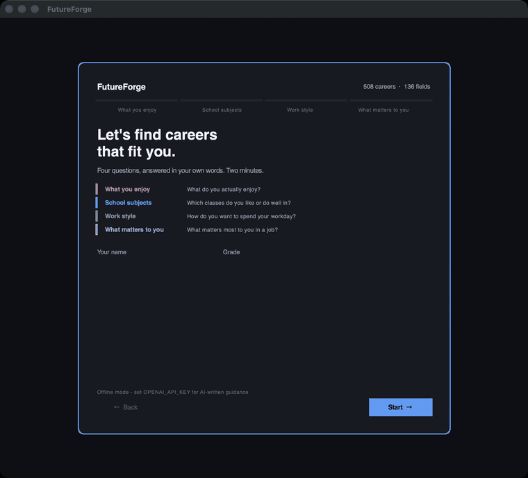
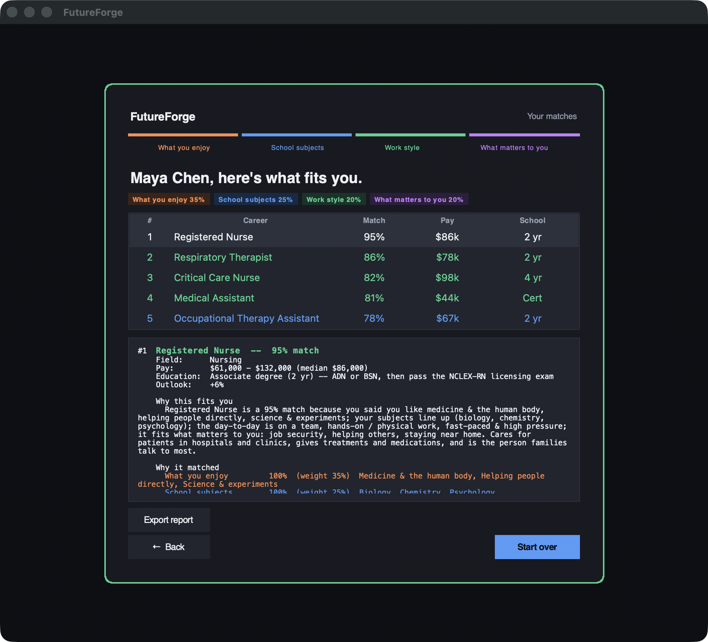

# FutureForge

[](https://github.com/Awesomeav23/FutureForge/actions/workflows/ci.yml)
[](LICENSE)
[](https://www.python.org/downloads/)

A Python career guidance application for high school students. Answer four questions,
get careers ranked to fit you — each with a real pay range, exactly how much school it
takes, and a plain-language explanation of *why* it matched your answers.

Built as a Tkinter desktop app so it can be handed to a non-technical student and
demoed on any machine with Python — no server, no browser, no account. Questions
come one at a time and are answered in the student's own words, not by ticking boxes.



Answers are typed in the student's own words — the chips resolve as they type, so
"i play piano and like helping people" becomes *Music, acting & performing* and
*Helping people directly*. Each of the four inputs owns a colour that follows it
through the whole app: its step pill, its heading, its chips, and its weight on the
results screen.




## Quick start

No dependencies, no API key, no network — the engine and both interfaces are pure
standard library.

```bash
git clone https://github.com/Awesomeav23/FutureForge.git
cd FutureForge

# runs anywhere Python does -- full ranked output in the terminal:
python3 -m futureforge.cli --profile examples/sample_student.json --top 5

# the desktop app:
python3 main.py
```

Optional extras: `pip install -r requirements.txt` (openai for AI-written guidance,
pytest for the suite).

<details>
<summary><b>macOS: the desktop app needs a modern Tk</b> (the CLI above does not)</summary>

Homebrew's Python ships no `_tkinter` at all, and Apple's `/usr/bin/python3` links
Tk 8.5.9 (2010), which opens a window but renders nothing on recent macOS. Install the
python.org build of 3.13 (bundles Tk 8.6) or `brew install python-tk@3.13`. Check with:

```bash
python3 -c "import tkinter; print(tkinter.Tk().tk.call('info','patchlevel'))"
```

Anything below 8.6 will not draw.
</details>

## The four weighted inputs

Every student answers four questions, and each answer carries an independent weight:

| # | Input | Default weight | Example answers |
|---|-------|----------------|-----------------|
| 1 | What you enjoy | 35% | animals, building things, computers, helping people |
| 2 | School subjects | 25% | biology, shop/tech, math, art |
| 3 | Work style | 20% | hands-on, on a team, outdoors, quiet focus |
| 4 | What matters to you | 20% | high pay, job security, start earning fast, own a business |

Question 4 also captures **how many years of school** the student will actually do (0–8)
and **how much pay matters** (1–5).

### How the score is computed

Inputs 1–3 are cosine similarity over tag sets — `|A ∩ B| / √(|A|·|B|)` — so overlap counts
without rewarding students who just check every box. Input 4 blends three things:

```
values_score = 0.60 · tag_overlap  +  0.25 · salary_fit  +  0.15 · education_fit
```

`salary_fit` slides from neutral toward the career's pay percentile as the student says pay
matters more; `education_fit` decays 25% per year of school beyond their stated limit. The four
weighted scores are summed, then multiplied by a feasibility factor (−8% per extra year of
school, floored at 0.5) so a doctorate never tops the list for someone who said "two years max"
— but stays visible rather than being hidden.

Every match keeps its four subscores **and the exact tags that overlapped**, which is what the
"Why it matched" panel shows and what gets sent to the language model as grounding.

## Dataset

`data/careers.json` — **508 careers across 136 fields** (healthcare, technology, engineering,
skilled trades, business, education, creative, public service, science, transportation,
hospitality, health & fitness, personal services). Each entry carries a salary range
(low / median / high), the education level and the specific credential required, job outlook,
and its tags in all four vocabularies:

```json
{"id":"electrician","title":"Electrician","field":"Skilled Trades","education":"certificate",
 "education_note":"4-5 year PAID apprenticeship, then journeyman license",
 "salary":{"low":45000,"median":62000,"high":104000},"outlook":"+11%",
 "interests":["building","machines","technology"],"subjects":["shop_tech","math","physics"],
 "work_style":["hands_on","independent","outdoors_env","structured"],
 "values":["short_training","making_things","high_pay","entrepreneurship"]}
```

Salary figures are illustrative US ranges in the style of BLS Occupational Outlook Handbook
data — swap in a live BLS export for production use. `dataset.py` validates every tag against
the four vocabularies at load time, so a typo fails loudly instead of silently scoring zero.

## AI guidance (optional)

With `OPENAI_API_KEY` set, each match gets guidance written for that specific student — why it
fits *their* answers, what to do this school year, which classes to take, what the day is
actually like. The prompt is grounded in the match data and the model is instructed never to
invent salary or degree facts.

```bash
export OPENAI_API_KEY=sk-...
export FUTUREFORGE_MODEL=gpt-4o-mini   # optional
python3 main.py
```

Without a key the app runs in **offline mode**: the same guidance is generated deterministically
from the match data. Everything works — GUI, CLI, batch, tests — with no key and no network.
Generated text is cached by (student answers, career) so re-running costs nothing.

## Command line

```bash
python3 -m futureforge.cli                                    # interactive questionnaire
python3 -m futureforge.cli --profile examples/sample_student.json --top 5
python3 -m futureforge.cli --profile examples/trades_student.json --markdown
python3 -m futureforge.cli --list-fields                      # what's in the dataset
```

## Batch runs

Reproducible cohort simulation — useful for checking that the engine covers the dataset
instead of funneling every student into the same five jobs. Students are built from twelve
archetypes spanning the dataset and then jittered, because sampling tags independently
invents people who like animals, study art and want quiet focus — a cohort of those measures
noise, not the engine:

```bash
python3 scripts/batch_demo.py --profiles 100 --top 5
```

```
Students simulated:        100
Recommendations produced:  500
Careers in dataset:        508 across 136 fields
Distinct careers surfaced: 177 (35% of the dataset)
Fields surfaced:           80 of 136
```

Coverage is bounded by the cohort: 100 students × top 5 is 500 slots for 508 careers, so
35% is close to the practical ceiling. It rises to 49% at 300 students and 57% at 600.


## Tests

```bash
pytest -q     # 34 tests, no network required
```

The suite covers dataset integrity (vocabulary, salary ordering, unique ids), the scoring
guarantees (a biology-and-helping student ranks nursing above software; re-weighting reorders
results; the schooling limit demotes long degrees; higher pay priority shifts the list toward
higher-paying work) and an end-to-end pass through the recommender and all three report formats.

## Project layout

```
main.py                  launch the desktop app
futureforge/
  models.py              StudentProfile, Career, Match, Recommendation
  dataset.py             load + validate careers.json against the tag vocabularies
  matching.py            the weighted four-input scoring engine (pure functions)
  generator.py           OpenAI generator, offline template generator, disk cache
  recommender.py         rank -> generate guidance -> Recommendation
  report.py              text / markdown / JSON report formatting
  textmatch.py           free-text answers -> tag vocabulary (3-tier matching)
  wizard.py              the colour-coded one-question-at-a-time GUI
  cli.py                 terminal questionnaire + scripted runs
data/careers.json        508 careers with salary ranges and degree requirements
scripts/batch_demo.py    cohort simulation + coverage report
docs/img/                demo GIF + screenshots used in this README
examples/                sample student profiles
tests/                   pytest suite
```

## Where this goes next

Nothing in the engine knows about the GUI. None of `matching.py`, `dataset.py`,
`models.py`, `recommender.py`, `report.py` or `textmatch.py` imports tkinter; they
depend only on the standard library and on each other, and `report.to_json()` already
serialises a full result. The Tk wizard and the CLI are both just consumers.

That makes a web version a wrapper rather than a rewrite. The planned shape:

| Endpoint | Backed by |
|----------|-----------|
| `GET /careers`, `GET /fields` | `dataset.load_careers()` |
| `POST /recommend` | `Recommender.recommend()`, returned as `report.to_json()` |
| `POST /extract` | `textmatch.extract()`, so a browser can show tags resolving as the user types |

No database is required: the catalogue is a static JSON file and there is no user state
to persist. Two things do change, and both are deliberate trade-offs rather than free
wins. The OpenAI key moves server-side, which is an improvement, since one key can serve
every visitor instead of each user supplying their own. But answers begin leaving the
device, where today nothing is transmitted at all without a key, so the "no server, no
browser, no account" claim at the top would need rewriting rather than copying across.

**None of this is built yet.** What exists today is the desktop app and the CLI described
above.

## Limitations

- Salary and outlook figures are illustrative, not a live BLS feed.
- The dataset is US-centric, and education paths differ by state and country.
- Matching reflects the tags a person assigned to each career; it is a conversation starter for
  a student and a counselor, not a verdict.

## Licence

MIT — see [LICENSE](LICENSE).
